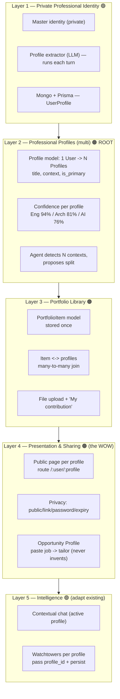
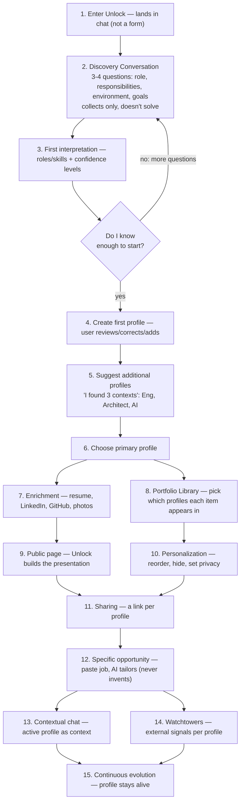
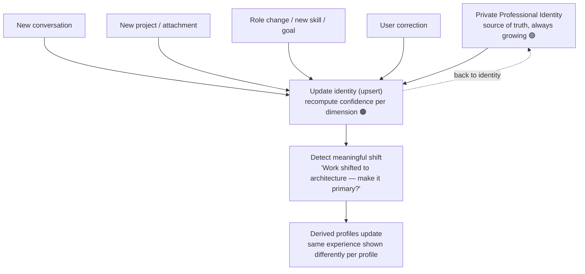
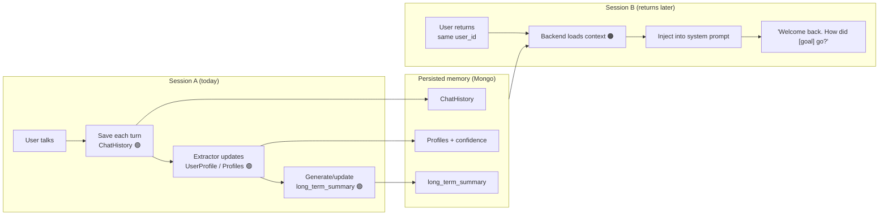
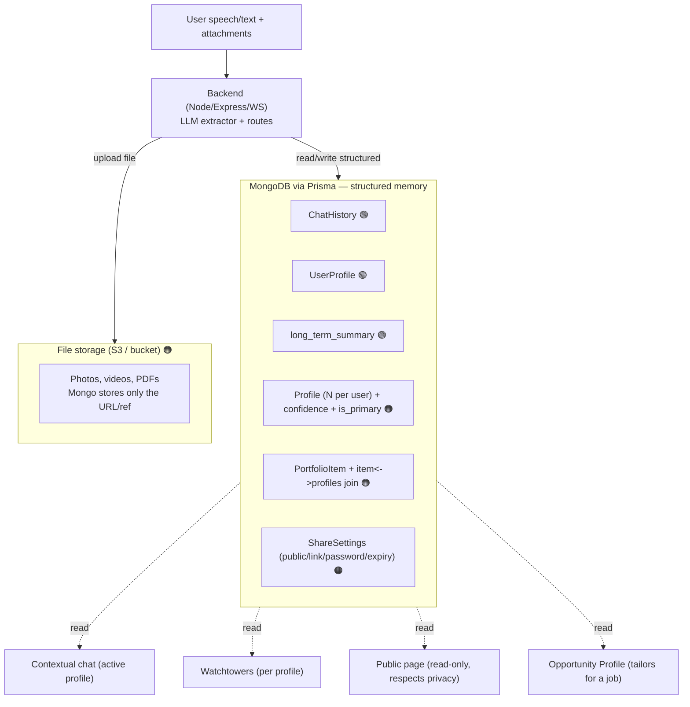

# Unlock — Architecture & Flows

> Living architecture reference. Diagrams are written in **Mermaid** so they render on
> GitHub and can be edited as text by Cursor.
>
> **Rule for Cursor / contributors:** whenever a change alters one of these flows
> (schema, agent behavior, routing, data path), update the relevant diagram in this
> file in the **same commit**. Keep code and diagrams in sync.
>
> Legend: 🟢 already exists (partial) · 🟠 new, to build

---

## 1. Application Map — 5 Layers

Each layer depends on the one above. Build order is top-down; **Layer 2 (multi-profile)
is the root** of the new work.

---

## 2. User Flow — End to End

---

## 3. Memory — Living Identity

The identity is never "done": each input updates confidence and can change the primary profile.

---

## 4. Memory — Across Sessions

When the user returns, the agent loads profile + history + long-term summary as context
instead of starting from zero.

> Already exists: ChatHistory, extractor, long_term_summary.
> Missing: inject context into the return prompt (returning-user greeting) + pick active profile.

---

## 5. Memory — Data & Storage

Golden rule: **Mongo stores structured memory** (text, refs, confidence); **large files go
to file storage** and Mongo keeps only the reference.

---

## Build Order (reminder)

1. **Layer 2 — multi-profile** (root; changes the schema: 1 User -> N Profiles)
2. **Layer 3 — Portfolio Library** (what profiles display)
3. **Layer 4 — shareable page** (the "wow"; heaviest — public routes, privacy, job tailoring)
4. **Layer 5 — adapt chat + Watchtowers** per profile (endpoint already exists)

**Before touching code:** confirm the current schema with `cat backend/prisma/schema.prisma`
and review the agent system prompt in `backend/index.ts`.
